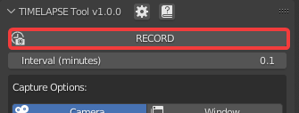
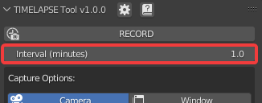
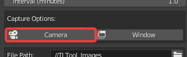

Settings
========

This section will go over all the options, buttons, and settings within TIMELAPSE Tool

Main
=====
RECORD
^^^^^^

This button will Start and Stop the Timelapse Recording. It is disabled until you've Saved and Selected a Capture Option

Interval (minutes)
^^^^^^^^^^^^^^^^^^

This is the duration of time (in minutes) between each image capture. Default is 1 minute. Using the slider you can reach a soft minimum of 0.5 minutes, and by typing in the field you can reach a hard minimum of 0.1 minutes.      

.. note::
    The lower your interval, the more likely you are to experience hitching. Keep this in mind if you are experiencing performance issues

Capture Options:
================
Camera
^^^^^^

This will capture from the perspective of Timelapse Cameras, and enable the Camera Editor.

Window
^^^^^^
.. image:: images/window_co.png
This will capture the entire window perspective.

.. note::
   You can have both Camera and Window enabled at the same time to capture both perspectives.

WORK IN PROGRESS. Head over to `Our Discord <https://discord.gg/5UK6uFnVV9>`_ for some help in the meantime. 
