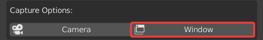

Settings
========

This section will go over all the options, buttons, and settings within TIMELAPSE Tool

RECORD
""""""
.. image:: images/record.png
This button will Start and Stop the Timelapse Recording. It is disabled until you've Saved and Selected a Capture Option

Interval (minutes)
""""""""""""""""""
.. image:: images/interval(minutes).png
This is the duration of time (in minutes) between each image capture. Default is 1 minute. Using the slider you can reach a soft minimum of 0.5 minutes, and by typing in the field you can reach a hard minimum of 0.1 minutes.      

.. note::
    The lower your interval, the more likely you are to experience hitching. Keep this in mind if you are experiencing performance issues

Capture Options:
----------------
Camera
""""""

This will capture from the perspective of Timelapse Cameras, and enable the Camera Editor.

Window
""""""

This will capture the entire window perspective.

.. note::
   You can have both Camera and Window enabled at the same time to capture both perspectives.

Camera Editor:
--------------
Add Camera
""""""""""
.. image:: images/add_camera.png
This will Add a Timelapse Camera to the Scene from your current viewport perspective. Atleast one Timelapse Camera is required for capturing with the Camera option.

Change Camera Name
""""""""""""""""""
.. image:: images/custom_name.gif
You can change the names of the Timelapse Cameras by double clicking their list entry and typing a new name.

Reorder Cameras
"""""""""""""""
.. image:: images/change_order.gif
You can also reorder the list with the arrows on the side

Enter Camera
""""""""""""
.. image:: images/enter_camera.png
This will move your viewport view into the selected Timelapse Camera.

Remove Camera
"""""""""""""

This will Remove the Timelapse Camera selected in the Camera Editor.

.. attention::
   Handle all additions and removals of Timelapse Cameras within the Camera Editor

WORK IN PROGRESS. Head over to `Our Discord <https://discord.gg/5UK6uFnVV9>`_ for some help in the meantime. 
