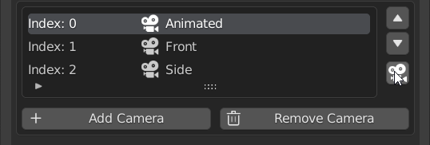
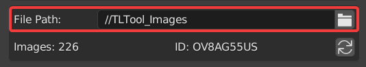
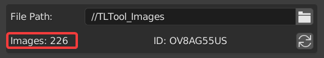
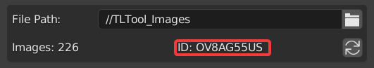
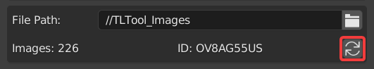

Settings
========

This section will go over all the options, buttons, and settings within TIMELAPSE Tool

RECORD
------

.. image:: images/record.png
This button will Start and Stop the Timelapse Recording. It is disabled until you've Saved and Selected a Capture Option

Interval (minutes)
------------------

.. image:: images/interval(minutes).png
This is the duration of time (in minutes) between each image capture. Default is 1 minute. Using the slider you can reach a soft minimum of 0.5 minutes, and by typing in the field you can reach a hard minimum of 0.1 minutes.      

.. note::
    The lower your interval, the more likely you are to experience hitching. Keep this in mind if you are experiencing performance issues

Camera
------

.. image:: images/camera.png
This will capture from the perspective of Timelapse Cameras, and enable the Camera Editor.

Window
------

.. image:: images/window.png
This will capture the entire window perspective.

.. note::
   You can have both Camera and Window enabled at the same time to capture both perspectives.

Add Camera
----------

This will Add a Timelapse Camera to the Scene from your current viewport perspective. Atleast one Timelapse Camera is required for capturing with the Camera option.

Change Camera Name
------------------

You can change the names of the Timelapse Cameras by double clicking their list entry and typing a new name.

Reorder Cameras
---------------

Reorder the list using the arrows on the side.

Enter Camera
------------

This will move your viewport view to the perspective of the selected Timelapse Camera. Pressing this button while inside the perspective of the selected Timelapse Camera will exit that camera.

Remove Camera
-------------

.. image:: images/remove_camera.png
This will Remove the Timelapse Camera selected in the Camera Editor.

.. attention::
   Handle all additions and removals of Timelapse Cameras within the Camera Editor.

Show Overlays and Gizmos
------------------------

When enabled, This will capture the overlays and gizmos visible from the camera perspective.

Animate
-------

When enabled, This will animate the timeline during the Timelapse Capture. Enable this if you have Timelapse cameras that have keyframes you want to animate.

.. note::
    Anything that has keyframes will animate during the Timelapse if this option is enabled

Lock Viewport Shading
---------------------

This will set the current viewport shading options and use them during the timelapse capture.

When the viewport shading is locked, the panel will unfold and display all the locked options. When locked, you are free to change what your viewport looks like, and these settings will stay the same during your timelapse capture.

File Path
---------

This is where the Timelapse images will be saved to. Default is a relative path folder next to your .blend file called "TLTool_Images"

Images
------

This is the number of image captures you've taken so far in your timelapse. This will count up everytime there is a new image capture.

ID
-----

This is the unique ID generated for your timelapse session. Your timelapse images will be saved to a subfolder with this id.

Regenerate ID
-------------

This will generate a new random timelapse ID, and reset the image counter to 0.

Generate Video From Sequence
----------------------------

.. image:: images/video.png
Once you have you have your timelapse recorded, pressing this button will automatically convert the image sequence into a video file. The framerate and aspect ratio are determined by your current project render settings. 

WORK IN PROGRESS. Head over to `Our Discord <https://discord.gg/5UK6uFnVV9>`_ for some help in the meantime. 
